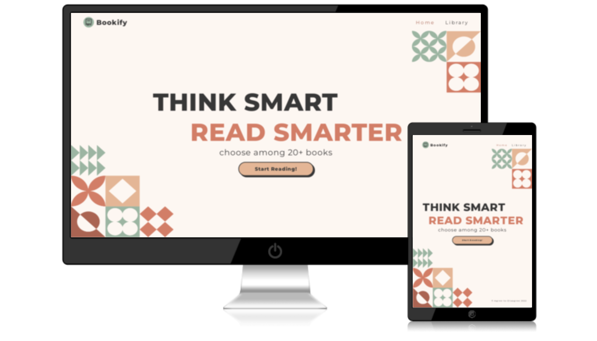

<h1 align="center">
     Bookify
</h1>

[View the live project here.](https://ersantuz.github.io/bookify/)

Welcome to Bookify! You can now have always your favourite books at your fingertips. 

The website is designed to be accessible everywhere, from your 💻 laptop at work to your ☎️ phone while travelling, making it perfect for every occasion. 

 
<h2 align="center"></h2>

## Manifesto 

**Murphy's law 101: "Whenever I decide to leave the book home, I have plenty of time to read."**

We got you! Now, with Bookify, you will always have your favorite books at your fingertips. Take your time to relax and read on the device you prefer. Discover our top picks on your mobile, filter for genres with your iPad, or tell us your mood on your computer.

Lose yourself in incredible stories and enjoy the journey.

## User Experience (UX)

-   ### User stories

    -   #### First Time Visitor Goals:

        As a First Time Visitor, I want to easily understand the main purpose of the site and learn more about the project and the team behind.

    -   #### Frequent User Goals
        As a Frequent Visitor, I want to be able to easily navigate throughout the site to find content I am interested to learn or read about.

-   ### Design
    -   #### Colour Scheme
        The main colours used are:
        -  Seashell Peach, as a relaxing reading background. 
        -  Terracotta, used to make content stand out.
        -  Summer Green, to add some color.  
    -   #### Typography
        -   The Montserrat font is the main font used throughout the whole website with Sans Serif as the fallback font in case for any reason Inter isn't being imported into the site correctly. Montserrat is a font used frequently for printed material, such as brochures, signage and even books; so it is both attractive and appropriate.

*   ### Wireframes

    -   Widescreen Wireframe - <a href="assets/pdf/Bookify - widescreens.pdf" target="_blank">View</a> 

    -   Mobile Wireframe - <a href="assets/pdf/Bookify - small screens.pdf" target="_blank">View</a> 

## Features

-   Responsive on all device sizes

-   Interactive buttons

## Technologies Used

### Languages Used

-   [HTML5](https://en.wikipedia.org/wiki/HTML5)
-   [CSS3](https://en.wikipedia.org/wiki/Cascading_Style_Sheets)
-   [JavaScript](https://en.wikipedia.org/wiki/JavaScript)

### Frameworks, Libraries & Programs Used

1. [Google Fonts:](https://fonts.google.com/)
    - Google fonts were used to import the 'Montserrat' font into the style.css file which is used on all pages throughout the project.
1. [epub.js:](https://github.com/futurepress/epub.js/)
    - epub.js was used to render epub documents on the website, essential in the purpose of the website.
1. [Font Awesome:](https://fontawesome.com/)
    - Font Awesome was used on throughout the website to add icons for aesthetic and UX purposes.
1. [Canva:](https://www.canva.com/)
    - Canva was used to design the logo and the landing page background.
1. [Git](https://git-scm.com/)
    - Git was used for version control by utilizing the Gitpod terminal to commit to Git and Push to GitHub.
1. [GitHub:](https://github.com/)
    - GitHub is used to store the projects code after being pushed from Git.
1. [Standard Ebooks:](https://standardebooks.org/)
    - Standard Ebooks provided the ebooks, book covers and book description.
1. [Page2images:](https://www.page2images.com/)
    - Page2images was used to create the [website screenshot](#wb-screen).
1. [Balsamiq:](https://balsamiq.com/)
    - Balsamiq was used to create the [wireframes](#wireframes) during the design process.

## Testing

The W3C Markup Validator, W3C CSS Validator Services and JSHint were used to validate every page of the project to ensure there were no syntax errors in the project. Lighthouse was used to validate the quality of the website.

-   [W3C Markup Validator](https://validator.w3.org/) - [Home Page](https://validator.w3.org/nu/?doc=https%3A%2F%2Fersantuz.github.io%2Fbookify%2Findex.html), [Library](https://validator.w3.org/nu/?doc=https%3A%2F%2Fersantuz.github.io%2Fbookify%2Flibrary.html), [Category](https://validator.w3.org/nu/?doc=https%3A%2F%2Fersantuz.github.io%2Fbookify%2Fcategory.html%3Fcat%3Dhappy), [Book](https://validator.w3.org/nu/?doc=https%3A%2F%2Fersantuz.github.io%2Fbookify%2Fbook.html%3Fid%3D20)
-   [W3C CSS Validator](https://jigsaw.w3.org/css-validator/#validate_by_input) - [Results](https://jigsaw.w3.org/css-validator/validator?uri=https%3A%2F%2Fersantuz.github.io%2Fbookify%2Findex.html&profile=css3svg&usermedium=all&warning=1&vextwarning=&lang=en)
-   [JSHint](https://jshint.com/) - No error found.
-   [Lighthouse](https://developers.google.com/web/tools/lighthouse) - [Desktop](assets/pdf/lighthouse_desktop.pdf), [Mobile](assets/pdf/lighthouse_mobile.pdf)

### Testing User Stories from User Experience (UX) Section

-   #### First Time Visitor Goals

    As a First Time Visitor, I want to easily understand the main purpose of the site and learn more about the team behind the project.

    1. Upon entering the site, users are automatically greeted with a clean and easily readable navigation bar to go to the page of their choice. Underneath there is a clear and breaf description of the website purpose with a "Start Reading" call to action button.
    1. The user has two options, navigate the website through a clear navigation bar or using the call to action buttons accessible by scrolling down the home page. Both choice will lead to the same results.

-   #### Frequent User Goals

    As a Frequent Visitor, I want to be able to easily navigate throughout the site to find content I am interested to learn or read about.

    1. The site has been designed to be fluid and never to entrap the user. At the top of each page there is a clean navigation bar, each link describes what the page they will end up at clearly.
    1. The theory part is designed to allow users to always know the category and the topic she/he is reading about. This aim is reached by highlighting in the navigation bar the section she/he is on, while (for theory sections) a sidebar for widescreens, and an hamburger style menu on mobiles and tablet, will clearly tell the user the topic of the page. Each theory section has a main page in which every topic is accessible through buttons. Finally, inside any topic's page the user can access other topic belonging to the same section through the sidebar and can access the section main page using either the navigation bar or a button at the end of the page.   

### Further Testing

-   The website was tested on Google Chrome, Microsoft Edge, Firefox and Safari.
-   The website was viewed on a variety of devices such as Desktop, Laptop, iPad Air, iPad Mini, iPhone SE, iPhone XR.
-   A large amount of testing was done to ensure that all pages were linking correctly.
-   Friends and family members were asked to review the site and documentation to point out any bugs and/or user experience issues.
-   Friends from economics' courses were asked to perform user testing to enanhce user experience throughout the website.

### Known Bugs

-   On Safari the carousel design doesn't work.
-   SEO performs worst on mobile devices since the paragraphs in the home page are hidden on smaller screen sizes.
-   Theory pages belonging to the macroeconomics sections are still on development, hence the buttons designed to lend on the content page won't open any page.

### Further Developments

-   The content for macroeconomics chapters will be added soon.
-   As outlined in the [manifesto](#manifesto), the website is planning to incorporate interactivity features in theoretical sections. This is planned to be done through the implentation of two main features: 
    1. iframes are going to be added, containing interactive graphs designed on [geogebra](https://www.geogebra.org/), which will allow users to interact with graphs related to the theory.   
    2. by means of python, [plotly](https://plotly.com/python/) interactive graphs will be added cointaining the results for major economic models. Such graphs will be interactive as they wll show how results changes by choosing different parameters of input.

## Deployment

### GitHub Pages

The project was deployed to GitHub Pages using the following steps...

1. Log in to GitHub and locate the [GitHub Repository](https://github.com/)
2. At the top of the Repository (not top of page), locate the "Settings" Button on the menu.
3. Click on the "Pages" section in the navbar.
4. Under "Source", click the dropdown called "None" and select "Master Branch".
5. The page will automatically refresh.
6. Scroll back down through the page to locate the now published site [link](https://ersantuz.github.io/pocket-economics/index.html) in the "GitHub Pages" section.

## Credits

### Content

-   All the pages were designed by the developer, always listening the precious suggestions of friends and tutor.
-   Button styles were taken from [getcssscan](https://getcssscan.com/css-buttons-examples).
-   The books, their covers and description were taken from [Standard Ebooks](https://standardebooks.org/).

### Acknowledgements

-   My friends for all the fun we always have together.

-   My Mentor for continuous helpful feedback.

-   Tutor support for their **support**.

